# **3x3 Matrix Operations using Verilog**

## **Project Overview**

This project implements various matrix operations using Verilog, specifically focusing on 3x3 matrices. It provides modules for matrix multiplication, matrix inversion (for upper triangular matrices), and rotation matrix generation using trigonometric functions. The core of the mathematical operations relies on a `CORDIC` (COordinate Rotation DIgital Computer) module, which performs efficient fixed-point arithmetic calculations for division, sine, and cosine values. 

### **MATLAB Models**
To verify and validate the Verilog implementation, MATLAB models were developed for both floating-point and fixed-point calculations. The models simulate the matrix operations and ensure that the results match the hardware outputs in accuracy and behavior.

The key modules in this project include:

- `cordic`: Implements CORDIC-based division and trigonometric calculations.
- `matrix_multiply`: Performs matrix multiplication between two 3x3 matrices.
- `inv_3x3_upper_triangular`: Computes the inverse of an upper triangular 3x3 matrix.
- `rotation_matrix1`, `rotation_matrix2`, `rotation_matrix3`: Generate rotation matrices using trigonometric inputs.
- `matrix_operations_top`: A top-level module integrating all the above components.

## **Table of Contents**

1. [Project Structure](#project-structure)
2. [System Overview](#system-overview)
3. [Modules and Functionality](#modules-and-functionality)
   - [1. CORDIC Module](#1-cordic-module-cordic)
   - [2. Matrix Multiplication](#2-matrix-multiplication-matrix_multiply)
   - [3. Inversion of 3x3 Upper Triangular Matrix](#3-inversion-of-3x3-upper-triangular-matrix-inv_3x3_upper_triangular)
   - [4. Rotation Matrices](#4-rotation-matrices-rotation_matrix1-rotation_matrix2-rotation_matrix3)
   - [5. Top Module](#5-top-module-matrix_operations_top)
4. [Testbench and Verification](#testbench-and-verification)
5. [MATLAB Models](#matlab-models)
6. [Simulation and Output](#simulation-and-output)
7. [Usage Instructions](#usage-instructions)
8. [Future Enhancements](#future-enhancements)
9. [Contributing](#contributing)
10. [License](#license)

## **Project Structure**

```
.
├── cordic.v
├── matrix_multiply.v
├── inv_3x3_upper_triangular.v
├── rotation_matrix1.v
├── rotation_matrix2.v
├── rotation_matrix3.v
├── matrix_operations_top.v
├── testbenches/
│   ├── tb_cordic.v
│   ├── tb_matrix_multiply.v
│   ├── tb_inv_3x3_upper_triangular.v
│   └── tb_rotation_matrix.v
├── matlab_models/
│   ├── floating_point_model.m
│   └── fixed_point_model.m
├── README.md
└── LICENSE
```

### **Project Statement**

- Write RTL for a 3x3 Matrix inversion block using QR decomposition implemented with CORDIC.
- CORDIC number of iterations: 15 iterations.
- Zynq UltraScale+ MPSoC ZCU104 Evaluation Kit
- Target Frequency: 150 MHz

### **Design steps**

- Problem of the Project
- Way to the Solution: QR Decomposition
- Modeling Floating point  on MATLAB
- Modeling Fixed point 
- Implementation RTL
- FPGA Flow

### **Problem Definition**

**Problem Definition**:Inverting a 3x3 matrix is a fundamental operation in many systems, such as signal processing, control systems, and wireless communications. In digital IC design, matrix inversion must be implemented efficiently to meet the high-performance and Time requirements.

**Challenges**:
In hardware, matrix inversion is computationally intensive.

Direct methods (e.g., Gaussian elimination) involve complex divisions, multiplications, and addition operations, making them costly in terms of area, power, and timing in digital circuits.

### **Challenges of Traditional Methods in Hardware**

**Resource Intensive:**
The number of operations grows quadratically with the size of the matrix **(O(n³))**.

- This consumes more hardware resources (adders, multipliers, dividers), leading to large chip area and higher power consumption.

**Latency:**
- Complex arithmetic operations cause longer delays, impacting real-time system performance.

- Traditional methods can introduce significant delays in processing.

- Division operations in particular are Hard to implement in hardware. (To save area or time)

### **Why QR Decomposition with CORDIC?**

**CORDIC:**
- It avoids the need for multipliers and dividers, using only shifts and adds, which are more hardware-efficient.
- Fixed-point arithmetic allows for a reduction in hardware complexity compared to floating-point implementations.

**QR Decomposition:**
- Breaks the matrix inversion problem into simpler steps involving rotations.
- Givens rotations (used in QR) can be easily implemented using CORDIC, allowing for efficient triangularization of the matrix.
- Once the matrix is triangular, the inverse is easier to calculate using back-substitution.

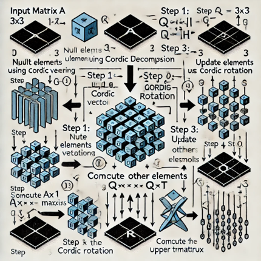

### **Hardware Benefits of CORDIC-based QR Decomposition**

**Reduced Complexity:**
- No division operations required, making it suitable for hardware implementation.
- CORDIC operations use shift-add algorithms, minimizing the use of multipliers.
**Pipelining and Parallelism:**
- The design can be pipelined to achieve high throughput.
- Iterative CORDIC processing allows for parallel execution, optimizing speed.
**Area and Power Efficiency:**
- CORDIC is known for being low-power and area-efficient, crucial for digital IC design.
- Ideal for embedded systems where power and area are limited resources.

### **Floating-Point Model Using MATLAB**

- The MATLAB code implements a floating-point model for performing 3x3 matrix inversion using QR decomposition combined with CORDIC operations. 


**Inputs**

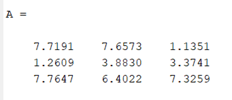

**Outputs**

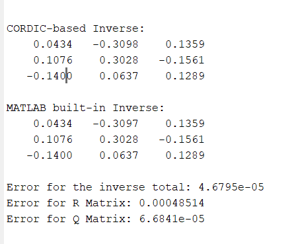


### **Fixed-Point Representation**

- Inputs are converted into fixed-point format using a specified word length (e.g., 16-bit) and fraction length (e.g., 12-bit) for high precision.
- **Resource Efficiency:** Lower hardware resource consumption compared to floating-point arithmetic, making it suitable for embedded systems.
- **Deterministic Precision:** Fixed-point arithmetic guarantees predictable behavior and precision.
- **Scalability:** The CORDIC algorithm is iterative and scalable for various precision levels. 


All matrices and intermediate calculations are performed using fixed-point arithmetic, defined by the following parameters:

- `WORDLEN = 16`: Total bit-width of the fixed-point representation.
- `FRACTION_WIDTH = 12`: Number of fractional bits.

The default scaling factor for inputs is `2^12` (i.e., 12 fractional bits). Outputs are scaled down accordingly to fit the defined format.

**Outputs of Fixed Point**

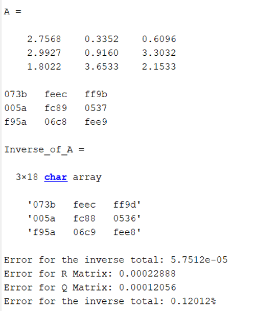

**Suitable Bit Width**


**Error 1.5%**

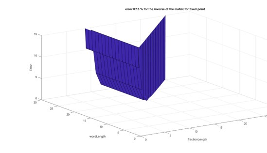 | 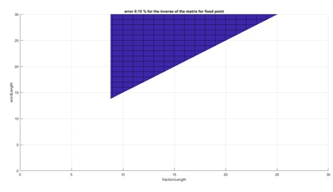

**Error 0.5%**

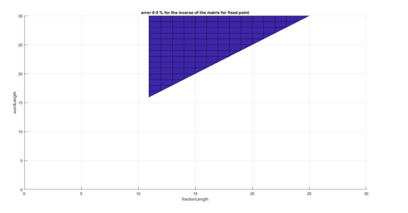

## **Modules and Functionality**

### 1. **CORDIC Algorithm Implementation (`cordic`)**

### **What is cordic**
- **CORDIC (COordinate Rotation DIgital Computer)** is a hardware-efficient iterative algorithm used in this project to perform various trigonometric, hyperbolic, and vector operations. For the 3x3 matrix inversion using QR decomposition, we applied CORDIC to compute rotations and vector operations needed to perform the **QR decomposition** in fixed-point precision. This allowed for efficient calculation of the Q and R matrices with reduced hardware complexity

**Cordic diagram**

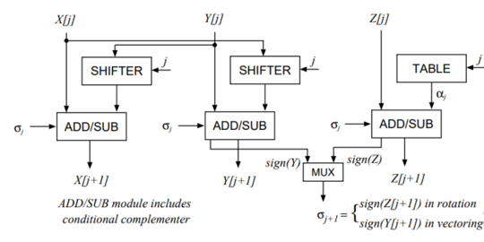

### **CORDIC General Functionality**
- **CORDIC** is an algorithm designed to calculate a wide range of mathematical functions using only additions, subtractions, bit shifts, and look-up tables. It is especially useful for systems where multiplication and division operations are costly.

**Cordic Blocks**

- Rotational 
- Vectoring 
- Division

### **CORDIC Vectoring for Zeroing Elements**

**Vectoring Mode:** The algorithm rotates the vector towards the x-axis by adjusting x and y coordinates.
**Iterations:** 15 steps using shift-add operations with LUT for angle adjustments.

**Result:**
- Provides final magnitude and theta angle after N iterations.
- Fixed-point scaling using a precomputed constant (K).

**Optimization**
- Theta is Normalized by 2𝜋 , for higher accuracy.
- Working with the upper half space +X to improve the performance and fix negative X values Error

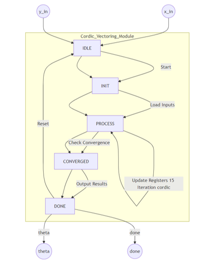

**Wave Form**

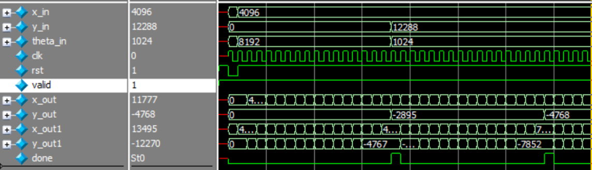

### **CORDIC Rotation for Matrix Updates**

**Purpose**: Rotates input vector (x_in, y_in) by a given angle (θ_in).
**Key Operations**: Iteratively rotates vector to achieve desired angle, outputting rotated coordinates (x_out, y_out).
**Precision**: 16-bit fixed-point arithmetic.
**Core Features**:
Same precomputed LUT for atan values.
Supports fast, precise vector rotation using iterative shifts and additions.
Provides x_out, y_out after rotation with respect to θ_in.

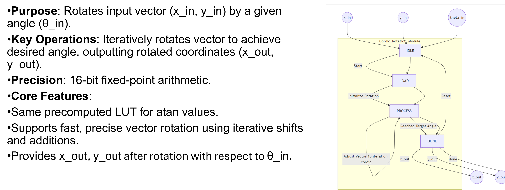

### **CORDIC Division Algorithm**


**Initialization:**
- Numerator (y) and Denominator (x) are set.
- Sign of numerator is tracked separately to apply at the end.
**Iterative Process (CORDIC-like method)**:
- Perform N iterations to converge on the quotient.
- If y (denominator) is negative, adjust y and decrement the quotient.
- If y is positive, adjust y and increment the quotient.
- **Step size** scales with the iteration to converge faster.
**Final State:**
After N iterations, apply the sign to the result and set done.
**Key Features:**
- **Word Length**: WORD_LENGTH = 16, allowing for signed 16-bit inputs.
- **Precision**: Uses 12 fractional bits.
- **Error Handling**: Detects zero numerator to prevent undefined division.

### **Enhancements to CORDIC Division Algorithm**

**Problem Addressed:**
- **Negative Division:** Initially, the algorithm didn't handle negative denominators.

**Solution Implemented:**
- **Handling Negative Numbers:**
Added support for division by negative numbers by extending the sign handling for both numerator and denominator. Now, the algorithm ensures correct results with both positive and negative inputs.

**Error Signal** out if the Matrix has No inverse and stop the Operations

**Problem Addressed:**
- **Output Limitation:** The quotient was capped at a maximum of 2 due to the algorithm's structure, leading to incorrect results in certain cases.

**Solution Implemented:**
- Adjusted the algorithm to ensure proper scaling of the result by bit-shifting the numerator.
- This correction removes the limitation, allowing the quotient to reach beyond 2, ensuring accurate results for a wider range of input values.

```
𝑧 <= 𝑧 + (16^′ ℎ1000 >>> (𝑖));
𝑠𝑡𝑒𝑝_𝑠𝑖𝑧𝑒 = (𝑎𝑏𝑠_𝑥);  
```
TO
```
𝒛 <= 𝒛 + (𝟏𝟔′𝒉𝟖𝟎𝟎𝟎 >>> (𝒊)); 
𝒂𝒔𝒔𝒊𝒈𝒏 𝒔𝒕𝒆𝒑_𝒔𝒊𝒛𝒆 = (𝒂𝒃𝒔_𝒙 <<< 𝟑);  

```

**Cordic Top FSM**

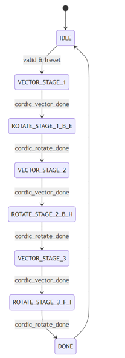

**R Matrix**

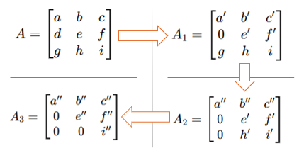

**Q Matrix**

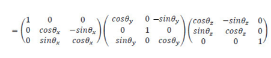

### **CORDIC FSM Module**

- FSM Structure and Steps:
- IDLE: Initialization of inputs and variables
- VECTOR_STAGE_1: First vectoring stage for - matrix elements a and d
- ROTATE_STAGE_1_B_E: Rotating stage for matrix - elements b and e
- ROTATE_STAGE_1_C_F: Rotating stage for matrix - elements c and f
- VECTOR_STAGE_2: Second vectoring stage for a - and g, calculates sin/cos1
- ROTATE_STAGE_2_B_H: Rotating stage for b and h
- ROTATE_STAGE_2_C_I: Rotating stage for c and i
- VECTOR_STAGE_3: Third vectoring stage for e and - h, calculates sin/cos2
- ROTATE_STAGE_3_F_I: Rotating stage for f and i, - calculates sin/cos3
- DONE: Output results and final matrix inversion

## Now , We have R and Q’s matrices

`𝐴=𝑄_3∗𝑄_2∗𝑄_1∗𝑅`

`𝐴^(−1)=〖〖(𝑄〗_3∗𝑄_2∗𝑄_1∗𝑅)〗^(−1)=〖(𝑄 ∗𝑅)〗^(−1)`

`𝐴^(−1)=𝑅^(−1)∗𝑄^(−1)=𝑅^(−1)∗𝑄^𝑇`

**Blocks we need?**
-Matrix Multiplier
-Upper Triangle matrix Inversion

### 2. **Matrix Multiplication (`matrix_multiply`)**

**Basic Algorithm**


- To calculate any element needed 3 Multiplier and 3 Adder 
We cannot meet timing

**Systolic array algorithm**

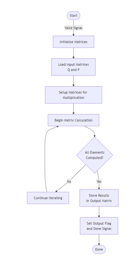 | 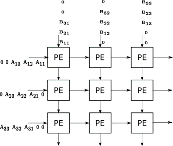


### 3. **Inversion of 3x3 Upper Triangular Matrix (`inv_3x3_upper_triangular`)**

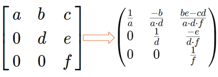

### 4. **Rotation Matrices (`rotation_matrix1`, `rotation_matrix2`, `rotation_matrix3`)**


**Orthonormal Matrix Q**

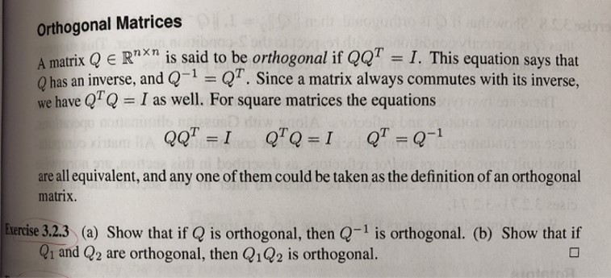

**And Finally, we will Re use the Systolic Array and get 𝐴_𝑖𝑛𝑣**

`〖𝐴^(−1)=〖〖(𝑄〗_3∗𝑄_2∗𝑄_1∗𝑅) 〗^(−1)=𝑅^(−1)∗𝑄〗^𝑇=𝐴_𝑖𝑛𝑣`

### 5. **Top Module (`matrix_operations_top`)**

**Block Diagram**

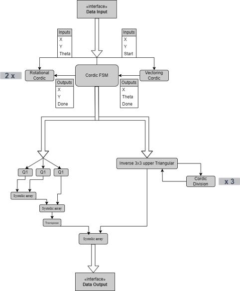

#### **Description:**
The `matrix_operations_top` module serves as the central controller for coordinating the different matrix operations. It accepts control signals and data inputs for the various matrix operations (e.g., matrix multiplication, inversion, rotation matrix generation) and selects the appropriate operation based on the mode input.

#### **Inputs:**

- `clk`: Clock signal.
- `rst`: Reset signal (active low).
- `mode`: Selects the matrix operation (e.g., `MULTIPLY`, `INVERSE`, `ROTATE`).
- `Q11, Q12, ..., Q33`: Elements of the first matrix (for multiplication mode).
- `P11, P12, ..., P33`: Elements of the second matrix (for multiplication mode).
- `a11, a12, ..., a33`: Elements of an upper triangular matrix (for inversion mode).
- `angle`: Input angle for rotation matrices.

#### **Outputs:**

- `R11, R12, ..., R33`: Resulting matrix elements.
- `valid`: Indicates that the operation has completed.
- `error`: Error flag indicating issues such as division by zero (for inversion mode).

#### **Operation:**

The top module uses an internal state machine to control the flow of operations:

- **Mode 1: Matrix Multiplication** - Selects `matrix_multiply` module.
- **Mode 2: Matrix Inversion** - Selects `inv_3x3_upper_triangular` module.
- **Mode 3: Rotation Matrix** - Uses `cordic` for trigonometric computations to construct the desired rotation matrix.

## **Testbench and Verification**

**Verification Goals**

- Ensure the correct implementation of the matrix inversion using QR decomposition with CORDIC.
- Verify the functional correctness of the QR decomposition process (Q and R matrix generation).
- Confirm the accuracy of the CORDIC-based QR computations.
- Ensure the final matrix inversion is correct.

**Key Features to Verify**

**QR Decomposition:**
- Verify that the input 3x3 matrix is decomposed into an orthogonal matrix QQQ and an upper triangular matrix RRR.
- Ensure CORDIC is correctly used for rotation in the QR process.
**Matrix Inversion:**
- Verify the computation of the inverse using R Inverse and Q matrices and transpose 
- Check for correct matrix multiplication steps.
- Check the matrix cannot be inverted like (zero matrix or R matrix has element on diagonal equal zero)
- Check for correct matrix multiplication steps.
**CORDIC Operations:**
- Confirm of the CORDIC algorithm.
- Verify the precision of rotation angles and scaling with the model 

**Verification Environment**

**Testbench Components:**
**Driver:** Feeds the input 3x3 matrix to the DUT (Device Under Test).
**Monitor:** Monitors output matrices (Q, R, and the inverted matrix).
**Checker:** Compares DUT output with the expected result from a golden model (MATLAB 

Each module has its own testbench, located in the `testbenches/` directory. The testbenches simulate various input cases and edge conditions. The `matrix_operations_top` testbench, `tb_matrix_operations_top.v`, verifies the integration and interaction of all modules.

## **Results of FPGA**

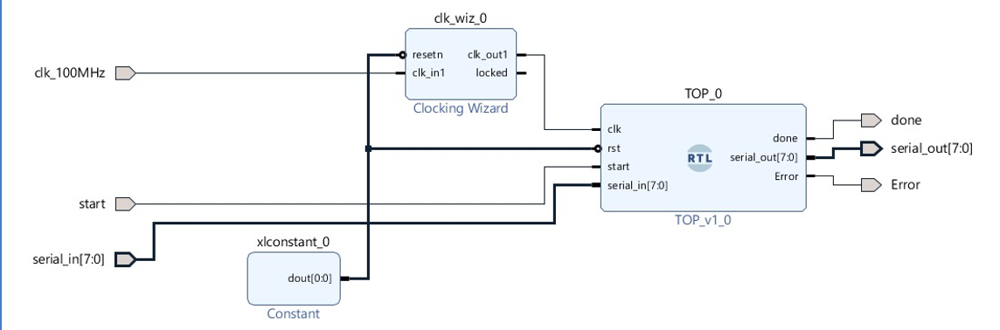

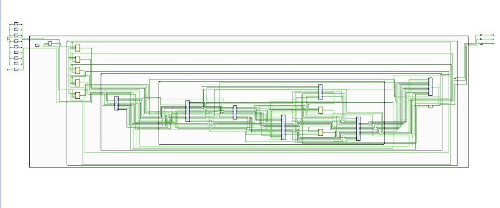

****Freqancy 150M**

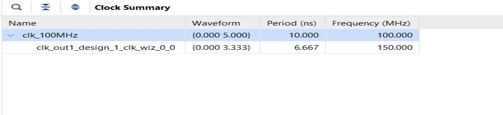

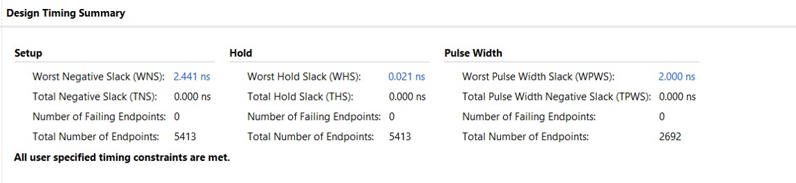

**Utilization**

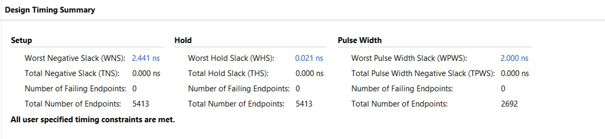

**Power**

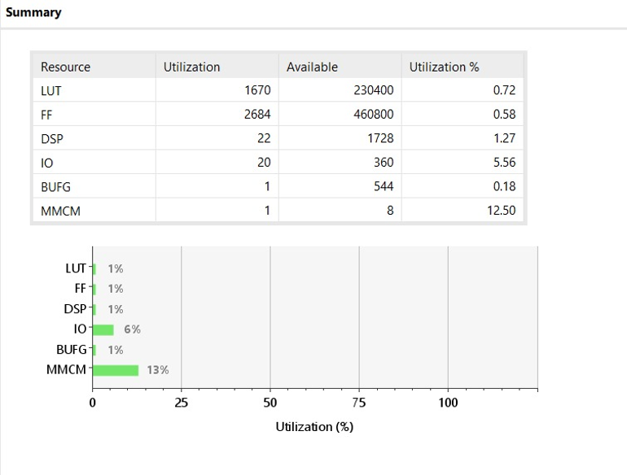

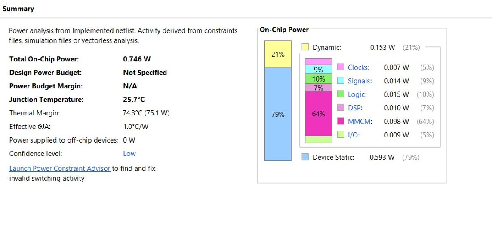

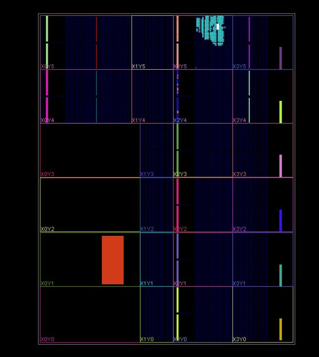

**Freqancy 200M**

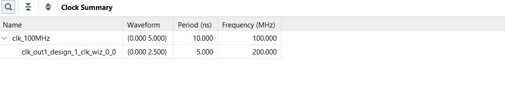

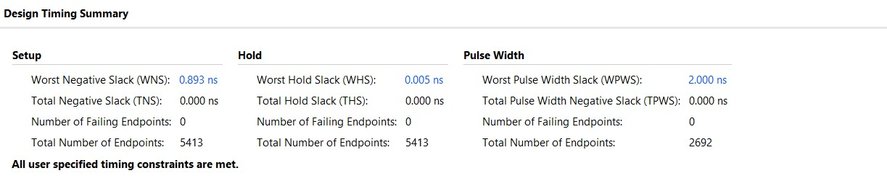

## **Future Enhancements**

**Extended Functional Verification using DPI-C & UVM**
- Integrate the MATLAB model into SystemVerilog using **DPI-C** (Direct Programming Interface for C).
- Utilize the MATLAB model for co-simulation to verify RTL design accuracy.
- Develop a UVM (Universal Verification Methodology) testbench to cover edge cases and stress the design under randomized inputs.
- **Verification goals:** Check for design correctness, corner cases, and performance under varying inputs.

**Increasing Matrix Size in RTL**
- Expand the RTL to support larger matrix sizes (e.g., 4x4, 5x5, etc.) using the same systolic array structure.

- Investigate the effect of increasing matrix sizes on latency, resource utilization, and power consumption.

